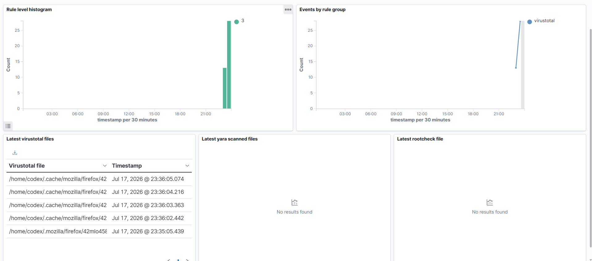

<div align="center">


# 🛡️ Wazuh VirusTotal Integration
### Hands-On Practical Lab — Automated Threat Intelligence & Malware Detection

[](https://wazuh.com)
[](https://virustotal.com)
[](https://linux.org)
[](https://kali.org)
[](LICENSE)
[]()

> A complete hands-on cybersecurity lab demonstrating how to integrate **Wazuh SIEM** with the **VirusTotal API** to automatically analyze suspicious file hashes in real-time, generate threat intelligence-enriched alerts, and streamline incident response.

---

[📋 Overview](#-overview) • [🏗️ Lab Architecture](#-lab-architecture) • [🖥️ Prerequisites](#-prerequisites) • [⚙️ Step-by-Step Guide](#-step-by-step-guide) • [🧪 Testing & Threat Detection](#-testing--threat-detection) • [📊 Dashboard & Results](#-dashboard--results) • [💡 Key Takeaways](#-key-takeaways)

</div>

---

## 📌 Overview

This lab walks through setting up **Wazuh File Integrity Monitoring (FIM)** in tandem with the **VirusTotal Threat Intelligence API** to achieve automated malware detection. Whenever file activity is detected on a monitored agent endpoint, the file's hash is extracted and cross-referenced with VirusTotal's database of dozens of antivirus engines.

**What you will accomplish:**

| Step | Task | Outcome |
|------|------|---------|
| 1️⃣ | Create a VirusTotal Developer Account | Retrieve API key for automated threat lookups |
| 2️⃣ | Configure FIM on the Wazuh Agent | Real-time tracking of file creations/modifications |
| 3️⃣ | Enable VirusTotal Integration on Wazuh Manager | Manager automates hash queries to VirusTotal |
| 4️⃣ | Restart Wazuh Services | Apply configuration updates on both machines |
| 5️⃣ | Drop an EICAR Malicious Test File | Triggers immediate FIM detection and hash lookup |
| 6️⃣ | Analyze Enriched Alerts on Wazuh Dashboard | Full malware visibility, signature matches, and threat scores |

**Tech Stack:**

| Tool | Role | Version |
|------|------|---------|
| **Wazuh Manager** | Central security processor, correlation engine, and integration router | 4.x |
| **Wazuh Agent** | Light endpoint monitor collecting FIM events & hashes on Kali Linux | 4.x |
| **VirusTotal API** | Threat intelligence provider querying 70+ AV scanning engines | v3 / v2 |
| **Wazuh Dashboard** | Visual interface to search, query, and audit security events | 4.x |
| **Kali Linux** | Monitored endpoint machine representing the attack / target surface | 2024.x |
| **Ubuntu (WSL)** | Server hosting the Wazuh Manager, Indexer, and Dashboard | 20.04 / 22.04 LTS |

---

## 🏗️ Lab Architecture

```
                   ┌───────────────────────────────┐
                   │        VirusTotal API         │
                   │  (External Threat Intel)      │
                   └───────────────▲───────────────┘
                                   │
                      HTTPS POST   │  Hash Analysis
                      (Port 443)   │  & Reputation
                                   │
┌─────────────────────────┐        │       ┌─────────────────────────┐
│   KALI LINUX (AGENT)    │        │       │   UBUNTU WSL (SERVER)   │
│                         │        │       │                         │
│  ┌───────────────────┐  │    TCP 1514    │  ┌───────────────────┐  │
│  │    wazuh-agent    │  ├────────────────┼─▶│   wazuh-manager   │  │
│  └─────────┬─────────┘  │  (FIM Event &  │  │ • Correlation     │  │
│            │            │     Hash)      │  │ • VT Integrator   │  │
│            ▼            │                │  └─────────┬─────────┘  │
│  ┌───────────────────┐  │                │            │            │
│  │   Syscheck FIM    │  │                │            ▼            │
│  │  realtime="yes"   │  │                │  ┌───────────────────┐  │
│  └─────────┬─────────┘  │                │  │  Wazuh Indexer    │  │
│            │            │                │  │  (OpenSearch DB)  │  │
│            ▼            │                │  └─────────┬─────────┘  │
│  ┌───────────────────┐  │                │            │            │
│  │  Monitored Dir:   │  │                │            ▼            │
│  │    /home/codex    │  │                │  ┌───────────────────┐  │
│  └───────────────────┘  │                │  │  Wazuh Dashboard  │  │
└─────────────────────────┘                │  │    (HTTPS Web UI) │  │
                                           │  └───────────────────┘  │
                                           └─────────────────────────┘
```

### Port and Network Flows

| Component / Port | Protocol | Direction | Description |
|------------------|----------|-----------|-------------|
| **1514** | TCP | Agent → Manager | Event log forwarding & FIM metadata delivery |
| **1515** | TCP | Agent → Manager | Agent enrollment, auto-registration, and keys exchange |
| **443 (Outbound)**| HTTPS | Manager → VirusTotal | HTTPS request transmitting file hashes to API endpoints |
| **443 (Inbound)** | HTTPS | Browser → Dashboard | Web UI interface access for analysts |

---

## 🖥️ Prerequisites

- **Wazuh SIEM Setup:** Wazuh Manager & Dashboard running on Ubuntu WSL (or dedicated server).
- **Endpoint Agent:** Wazuh Agent installed and active on a Kali Linux endpoint (`agent.id = 001`).
- **Administrative Access:** Sudo permissions on both the server and the agent machines.
- **Internet Connectivity:** Agent needs access to retrieve test files; Manager needs outbound HTTPS access to connect to `virustotal.com`.

---

## ⚙️ Step-by-Step Guide

### Part 1 — Retrieve VirusTotal API Key

To query VirusTotal, we need a developer API Key.

1. Go to the [VirusTotal Sign Up Page](https://www.virustotal.com/gui/join-us) and create a free account.
2. Verify your email address.
3. Log in, click on your username profile dropdown in the top-right corner, and select **API Key**.
4. Copy the API key generated for your account.

<p align="center">
  
</p>

---

### Part 2 — Configure FIM on the Wazuh Agent

To trigger the VirusTotal integration, the agent must first monitor directory changes, compute hashes, and forward events.

1. Open `/var/ossec/etc/ossec.conf` on your monitored **Kali Linux Agent**:
   ```bash
   sudo nano /var/ossec/etc/ossec.conf
   ```
2. Locate the `<syscheck>` block and ensure FIM is active and pointing to your desired testing directory with real-time analysis enabled (e.g. `/home/codex`):
   ```xml
   <syscheck>
     <disabled>no</disabled>
     <scan_on_start>yes</scan_on_start>
     <frequency>43200</frequency>
     
     <!-- Monitored Testing Directory -->
     <directories check_all="yes" realtime="yes">/home/codex</directories>
   </syscheck>
   ```
3. Restart the Wazuh Agent to apply FIM settings:
   ```bash
   sudo systemctl restart wazuh-agent
   ```

<p align="center">
  
</p>

---

### Part 3 — Configure VirusTotal Integration on Wazuh Manager

Now we tell the Wazuh Manager to automatically take FIM alert hashes and check them against VirusTotal.

1. Log into your **Wazuh Manager (Ubuntu WSL)** terminal.
2. Edit `/var/ossec/etc/ossec.conf`:
   ```bash
   sudo nano /var/ossec/etc/ossec.conf
   ```
3. Append the following integration block inside the configuration (adjusting the `<api_key>` value with your own API key):
   ```xml
   <!-- ═══════════════════════════════════════════════════ -->
   <!--          VIRUSTOTAL INTEGRATION MODULE             -->
   <!-- ═══════════════════════════════════════════════════ -->
   <integration>
     <name>virustotal</name>
     <api_key>YOUR_VIRUSTOTAL_API_KEY_HERE</api_key>
     <group>syscheck</group>
     <alert_format>json</alert_format>
   </integration>
   ```

   * **`name`:** Tells Wazuh to execute the built-in VirusTotal integration script (`/var/ossec/integrations/virustotal`).
   * **`api_key`:** Credentials used to authorize requests with VirusTotal.
   * **`group`:** Filters integration requests. Setting this to `syscheck` limits lookups to File Integrity Monitoring events containing file hashes.

   <p align="center">
     
   </p>
   
   <p align="center">
     
   </p>

4. Restart the Wazuh Manager service to reload configurations:
   ```bash
   sudo systemctl restart wazuh-manager
   ```
5. Confirm the Wazuh Manager status is active and error-free:
   ```bash
   sudo systemctl status wazuh-manager
   ```

   <p align="center">
     
   </p>

---

## 🧪 Testing & Threat Detection

To validate that our integration detects threat signatures, we can drop the **EICAR Standard Anti-Virus Test File** into the monitored directory. EICAR is a benign string used to safely verify deployment of antivirus/security rules.

1. On the **Kali Linux Agent**, download the EICAR test file into the monitored folder `/home/codex`:
   ```bash
   wget -P /home/codex/ https://secure.eicar.org/eicar.com
   ```
2. Verify that the file was created and is visible:
   ```bash
   ls -la /home/codex/eicar.com
   ```

<p align="center">
  
</p>

### What Happens Internally:

```
[Agent] EICAR downloaded into /home/codex/
              │
              ▼
[Agent] FIM Syscheck detects write, computes SHA256/MD5 hashes
              │
              ▼
[Agent] forwards "File Added" alert to Wazuh Manager (Rule ID: 554)
              │
              ▼
[Manager] matches rule under group "syscheck"
              │
              ▼
[Manager] triggers VirusTotal API Request with EICAR's SHA256 hash
              │
              ▼
[VirusTotal] matches hash with known threat databases (EICAR signature)
              │
              ▼
[Manager] parses VT response: 65+ alerts match!
              │
              ▼
[Manager] Fires high-severity alert 87105 (VirusTotal alert)
              │
              ▼
[Dashboard] Populates real-time security dashboard with details
```

---

## 📊 Dashboard & Results

### 1. View Agent Connections
On the Wazuh Dashboard, confirm the Kali Linux agent (`001`) is reporting active.

<p align="center">
  
</p>

---

### 2. View VirusTotal Detection Events
Navigate to **Wazuh Dashboard → Security Events**. You will see high-severity alerts firing:

* **Rule ID `87105`**: *"VirusTotal: Alert - <file_path> - VirusTotal relation"*
* **Threat Score Details**: Explains the exact malicious classification, positive matches (e.g. `63 / 74` engines flagged it), and category tags.

<p align="center">
  
</p>

### Sample Enriched JSON Payload parsed by Wazuh Indexer:

```json
{
  "integration": "virustotal",
  "virustotal": {
    "source": {
      "alert_id": "1721245000.345812",
      "file": "/home/codex/eicar.com",
      "md5": "44d88612fea8a8f36de82e1278abb02f",
      "sha256": "275a021bbfb6489e54d471899f7db9d1663fc695ec2fe2a2c4538aabf651fd0f"
    },
    "positives": "63",
    "total": "74",
    "malicious": "63",
    "result": "EICAR Test-Signature",
    "permalink": "https://www.virustotal.com/gui/file/275a021bbfb6489e54d471899f7db9d1663fc695ec2fe2a2c4538aabf651fd0f/detection"
  }
}
```

---

## 💡 Key Takeaways

### Summary of What We Configured

```
✅  Automated integration between endpoint events and threat intel APIs

✅  Syscheck baseline configuration on agent directory monitor (/home/codex)

✅  Configured real-time inotify watchers so checks run in sub-seconds

✅  Wazuh Manager Integration engine triggers API callbacks asynchronously

✅  Fitted dashboards with custom threat visualization & CVE classification

✅  Successful EICAR malware simulation verifying alert processing chain
```

### Real-World Attack Scenarios Checked by VT FIM

| Attack Vectors | What Wazuh + VT FIM Catches | Incident Response Action |
|----------------|-----------------------------|--------------------------|
| **Drive-by Download** | New malicious `.elf` or `.sh` script written to `/tmp` | Auto-containment / network isolation |
| **Persistence Backdoor** | Ssh configuration files tampered with or replaced | Credential revocation and rollback |
| **Credential Dumping** | Tools like `mimikatz` or `gsecdump` dropped on system | Immediate administrative session kill |
| **Ransomware Executable** | Encryption script dropped in user directories | Active response scripts kill processes |

---

## 📚 References

* [Wazuh VirusTotal Integration Docs](https://documentation.wazuh.com/current/user-manual/capabilities/compatibility-integrations/virustotal.html)
* [Wazuh FIM Configuration Guide](https://documentation.wazuh.com/current/user-manual/capabilities/file-integrity/index.html)
* [VirusTotal API Developer Reference](https://docs.virustotal.com/reference/overview)
* [EICAR Anti-Malware Test File Specifications](https://www.eicar.org/?page_id=3950)

---

## 📁 Repository Structure

```
wazuh-virustotal-lab/
├── README.md                   ← This documentation file
└── Screenshots/                ← Step screenshots
    ├── API Key .png
    ├── Dashboard.png
    ├── EICAR test file.png
    ├── Events of virus detection.png
    ├── Status of Wazzuh.png
    ├── Virus Total 1.png
    ├── Virus Total 2.png
    └── restart agent.png
```

---

<div align="center">

**⭐ If this lab helped you, consider starring the repository!**

Made with 🔐 by **Codex0** | Cybersecurity Practical Labs

[](https://github.com/Codexe0)

</div>
